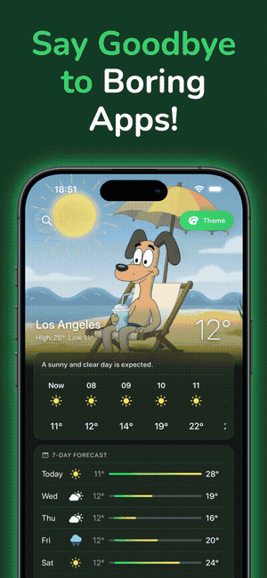
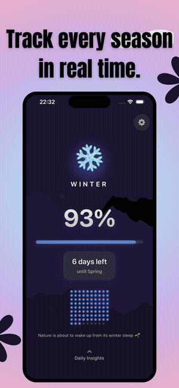

# Hey, I'm Enes 👋🏾

Software developer with a Computer Engineering degree from Erciyes University. Interested in algorithms, AI, and building things people actually use. Currently focused on iOS development, AI, and backend technologies.

---

## 📱 My iOS Apps

### [Cartoon Weather — Cute Forecast](https://apps.apple.com/us/app/cartoon-weather-cute-forecast/id6757344541)

> A weather app that turns your daily forecast into a fun experience with hand-crafted animated characters that react to real weather conditions.

---

### [Seasons — Solstice Tracker](https://apps.apple.com/us/app/seasons-solstice-tracker/id6758998537)

> Track where you stand in the year — season progress, solstice & equinox countdowns, moon phases, and sunrise/sunset times with beautiful animated themes.

---

## 📫 Contact

- [LinkedIn](https://www.linkedin.com/in/enesgunumdogdu/)
- [Email](mailto:enesgunumdogdu0@gmail.com)
- [Web](https://www.enesgunumdogdu.com.tr)
