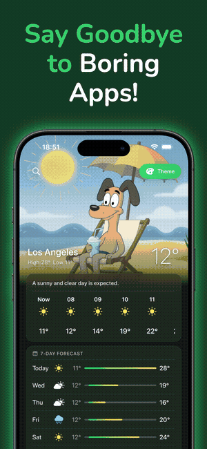
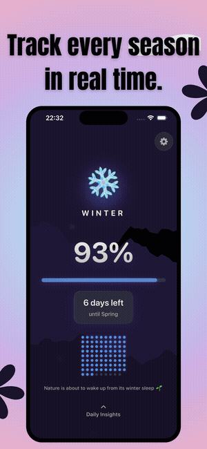
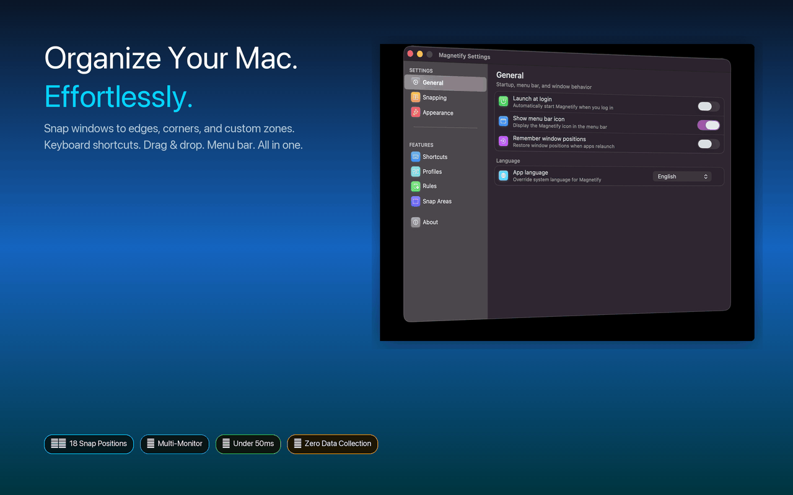

# Hey, I'm Enes 👋🏾

Software developer with a Computer Engineering degree from Erciyes University. Interested in algorithms, AI, and building things people actually use. Currently focused on iOS development, AI, and backend technologies.

---

## 📱 My Apps

<table>
  <tr>
    <td align="center" width="50%">
      <h3><a href="https://apps.apple.com/us/app/cartoon-weather-cute-forecast/id6757344541">Cartoon Weather — Cute Forecast</a></h3>
      
<em>A weather app with hand-crafted animated characters that react to real weather conditions.</em>

      
        
      
    </td>
    <td align="center" width="50%">
      <h3><a href="https://apps.apple.com/us/app/seasons-solstice-tracker/id6758998537">Seasons — Solstice Tracker</a></h3>
      
<em>Track season progress, solstice & equinox countdowns, moon phases, and sunrise/sunset times.</em>

      
        
      
    </td>
  </tr>
  <tr>
    <td align="center" colspan="2">
      <h3><a href="https://github.com/enesgunumdogdu/Magnetify">Magnetify — Window Manager for macOS</a></h3>
      
<em>A powerful, lightweight, open-source window manager for macOS. Snap, tile, and organize windows effortlessly.</em>

      
        
      
    </td>
  </tr>
</table>

---

## 📫 Contact

- [LinkedIn](https://www.linkedin.com/in/enesgunumdogdu/)
- [Email](mailto:enesgunumdogdu0@gmail.com)
- [Web](https://www.enesgunumdogdu.com.tr)
